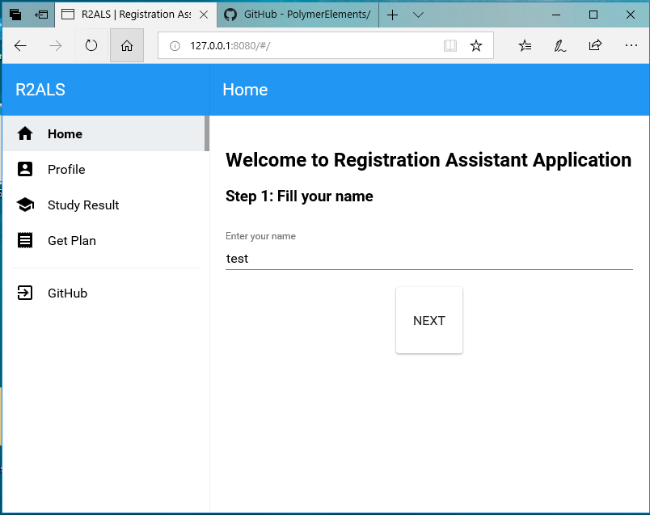

# R2ALS-app
An application of R2ALS project

## This project is deprecated
> **No longer maintenance**

This project uses Polymer 0.53 as a core application, which is no longer supported by Google
This project can't run on Chrome 45 due to lack of web technology

The last capture


## Changelog
- Move from `bower` to `yarn`
- Replace many packages with the other place repositories (using [googlearchive](https://github.com/googlearchive))

# Briefly Installation

- Prerequistie
nodejs

```
npm install -g yarn 
yarn install
```
# Full Installation Guide

Web application Installation can install on normally web hosting or same machine. There are many software to perform as web server such as Apache, Nginx, Xampp, nodejs and python. This instruction describes install web application via python.

1.	Prepare server machine for the experiment by using Debian Jessie.
2.	Enter the terminal.
3.	Install prerequisite packages for this project. If all of those packages have installed, you can skip this step.
sudo aptitude install git python3 python3-pip nodejs
4.	Test node command using command below. The result must get version of nodejs.
```
node --version
```
If the result of the command shows that “command not found: node”. Using below command to solve the problem.
```
ln -s /usr/bin/nodejs /usr/bin/node
```
5.	Install yarn from npm command
```
sudo npm install –g yarn 
```
6.	Access the target directory
```
mkdir ~/app
cd ~/app
```
7.	Place the source code in the target directory. Use the git command to download lastest version source code from github.
```
git clone https://github.com/mildronize/R2ALS-app.git
```
8.	Access the directory from step 7.
```
cd R2ALS-app
```
9.	Setup prerequisite packages for web using this command.
```
yarn install
```
10.	Run the server.
```
python3 –m http.server 80
```
To access the web application via the browser using URL below 
```
http://your_domain_name/ 
```
In case of development using below URL
```
http://localhost/
```

